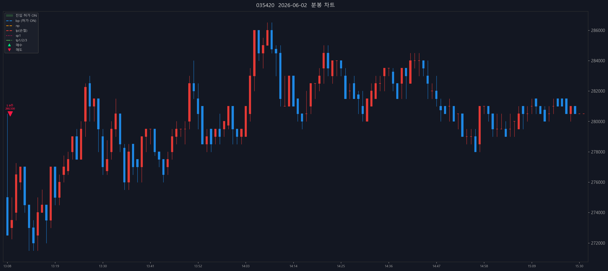

# 📒 매매일지 — 2026-06-02 (KR 종가 기준)

> 생성 시각: 2026-06-13 00:33:51 · 출처: kiwoom-api-service · **계좌구분 미기록**

---

## 0. 당일 총평

- 체결 종목: 1종 / 체결 2건 (매수 0 · 매도 2)
- 실현손익: +794,274원 (FIFO, 수수료·세금 제외)
- 계좌: **계좌구분 미기록**
- 메모: (직접 작성 — 진입 근거, 실수, 개선점)

---

## 1. NAVER (035420)

- 종목 실현손익(FIFO): +794,274원

### 1.1 체결 타임라인

| 시각 | 구분 | 수량 | 체결가 | phase | 비고 |
|---:|---|---:|---:|---|---|
| 09:00:37 | 매도 | 8 | 280,500 | sell_order_partial | 분할체결 |
| 09:00:37 | 매도 | 9 | 280,500 | final | 전량청산 |

### 1.2 종목별 차트

---

_Generated by kiwoom-api-service journal export._