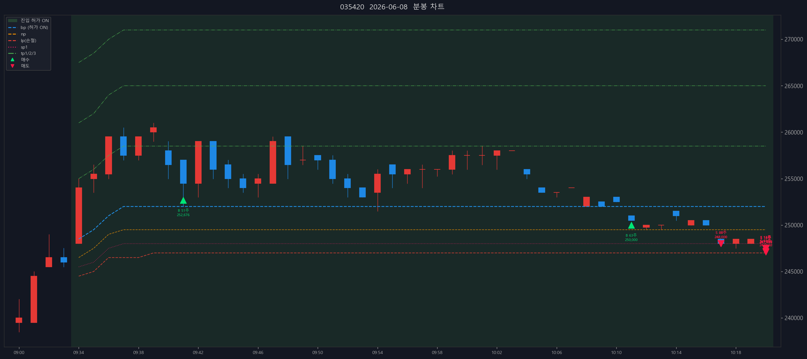

# NAVER (035420) — 2026-06-08

- 실현손익(당일 단순): +46,361,513원 (수수료 제외)

## 체결 타임라인

| 시각 | 구분 | 수량 | 체결가 | phase | 비고 |
|---:|---|---:|---:|---|---|
| 09:41:24 | 매수 | 51 | 252,676 | [매수 체결] |  |
| 10:11:25 | 매수 | 63 | 250,000 | [2차 추매 체결] |  |
| 10:16:57 | 매도 | 34 | 248,000 | sell_order_partial | 분할체결 |
| 10:16:57 | 매도 | 37 | 248,000 | sell_order_partial | 분할체결 |
| 10:16:57 | 매도 | 45 | 248,000 | partial | 부분청산 |
| 10:20:12 | 매도 | 12 | 247,500 | sell_order_partial | 분할체결 |
| 10:20:12 | 매도 | 13 | 247,500 | sell_order_partial | 분할체결 |
| 10:20:12 | 매도 | 14 | 247,464 | sell_order_partial | 분할체결 |
| 10:20:12 | 매도 | 15 | 247,433 | sell_order_partial | 분할체결 |
| 10:20:12 | 매도 | 64 | 247,102 | sell_order_partial | 분할체결 |
| 10:20:12 | 매도 | 69 | 247,130 | final | 전량청산 |

## 차트

---

_Generated by kiwoom-api-service journal export._