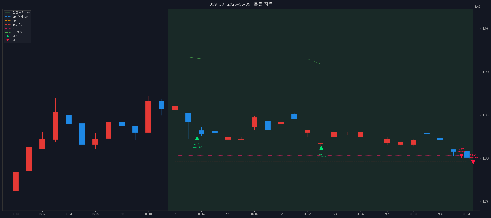
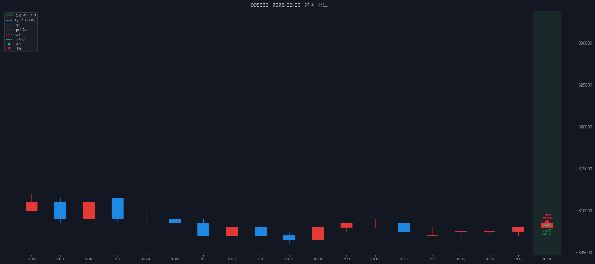

# 📒 매매일지 — 2026-06-09 (KR 종가 기준)

> 생성 시각: 2026-06-13 00:33:51 · 출처: kiwoom-api-service · **계좌구분 미기록**

---

## 0. 당일 총평

- 체결 종목: 5종 / 체결 57건 (매수 9 · 매도 48)
- 실현손익: -43,143원 (FIFO, 수수료·세금 제외) · (매입단가 미확인 4주 제외) · (매입단가 미확인 39주 제외) · (매입단가 미확인 19주 제외) · (매입단가 미확인 153주 제외) · (매입단가 미확인 4291주 제외)
- 계좌: **계좌구분 미기록**
- 메모: (직접 작성 — 진입 근거, 실수, 개선점)

---

## 1. SK하이닉스 (000660)

- 종목 실현손익(FIFO): -174,000원 (매입단가 미확인 4주 제외)

### 1.1 체결 타임라인

| 시각 | 구분 | 수량 | 체결가 | phase | 비고 |
|---:|---|---:|---:|---|---|
| 09:12:04 | 매수 | 14 | 2,043,571 | [매수 체결] |  |
| 09:13:36 | 매도 | 5 | 2,040,000 | partial | 부분청산 |
| 09:14:43 | 매도 | 1 | 2,036,000 | sell_order_partial | 분할체결 |
| 09:20:05 | 매수 | 14 | 2,044,929 | [매수 체결] |  |
| 09:21:43 | 매도 | 5 | 2,040,000 | partial | 부분청산 |
| 09:21:45 | 매도 | 1 | 2,037,000 | sell_order_partial | 분할체결 |
| 09:21:45 | 매도 | 3 | 2,037,000 | sell_order_partial | 분할체결 |
| 09:21:45 | 매도 | 17 | 2,037,000 | final | 전량청산 |

### 1.2 종목별 차트

## 2. SK스퀘어 (402340)

- 종목 실현손익(FIFO): -55,665원 (매입단가 미확인 39주 제외)

### 2.1 체결 타임라인

| 시각 | 구분 | 수량 | 체결가 | phase | 비고 |
|---:|---|---:|---:|---|---|
| 09:13:26 | 매수 | 10 | 1,196,000 | [매수 체결] |  |
| 09:13:37 | 매수 | 13 | 1,194,000 | [2차 추매 체결] |  |
| 09:14:20 | 매도 | 1 | 1,192,000 | sell_order_partial | 분할체결 |
| 09:14:21 | 매도 | 3 | 1,192,667 | sell_order_partial | 분할체결 |
| 09:14:21 | 매도 | 8 | 1,192,875 | sell_order_partial | 분할체결 |
| 09:14:22 | 매도 | 9 | 1,192,889 | partial | 부분청산 |
| 09:14:48 | 매도 | 1 | 1,188,000 | sell_order_partial | 분할체결 |
| 09:14:48 | 매도 | 3 | 1,189,333 | sell_order_partial | 분할체결 |
| 09:14:48 | 매도 | 11 | 1,190,545 | sell_order_partial | 분할체결 |
| 09:14:48 | 매도 | 12 | 1,190,500 | sell_order_partial | 분할체결 |
| 09:14:49 | 매도 | 14 | 1,190,429 | final | 전량청산 |

### 2.2 종목별 차트

## 3. 삼성전기 (009150)

- 종목 실현손익(FIFO): -250,003원 (매입단가 미확인 19주 제외)

### 3.1 체결 타임라인

| 시각 | 구분 | 수량 | 체결가 | phase | 비고 |
|---:|---|---:|---:|---|---|
| 09:13:40 | 매수 | 7 | 1,823,429 | [매수 체결] |  |
| 09:23:02 | 매수 | 8 | 1,812,000 | [2차 추매 체결] |  |
| 09:33:36 | 매도 | 4 | 1,803,000 | sell_order_partial | 분할체결 |
| 09:33:36 | 매도 | 6 | 1,803,000 | partial | 부분청산 |
| 09:34:29 | 매도 | 3 | 1,796,000 | sell_order_partial | 분할체결 |
| 09:34:29 | 매도 | 4 | 1,796,000 | sell_order_partial | 분할체결 |
| 09:34:29 | 매도 | 8 | 1,796,000 | sell_order_partial | 분할체결 |
| 09:34:29 | 매도 | 9 | 1,796,000 | final | 전량청산 |

### 3.2 종목별 차트

## 4. 삼성전자 (005930)

- 종목 실현손익(FIFO): +279원 (매입단가 미확인 153주 제외)

### 4.1 체결 타임라인

| 시각 | 구분 | 수량 | 체결가 | phase | 비고 |
|---:|---|---:|---:|---|---|
| 09:18:59 | 매수 | 93 | 308,497 | [매수 체결] |  |
| 09:19:00 | 매도 | 1 | 308,500 | sell_order_partial | 분할체결 |
| 09:19:00 | 매도 | 31 | 308,500 | sell_order_partial | 분할체결 |
| 09:19:00 | 매도 | 36 | 308,500 | sell_order_partial | 분할체결 |
| 09:19:00 | 매도 | 41 | 308,500 | sell_order_partial | 분할체결 |
| 09:19:00 | 매도 | 44 | 308,500 | sell_order_partial | 분할체결 |
| 09:19:00 | 매도 | 93 | 308,500 | final | 전량청산 |

### 4.2 종목별 차트

## 5. 성호전자 (043260)

- 종목 실현손익(FIFO): +436,246원 (매입단가 미확인 4291주 제외)

### 5.1 체결 타임라인

| 시각 | 구분 | 수량 | 체결가 | phase | 비고 |
|---:|---|---:|---:|---|---|
| 09:29:35 | 매수 | 266 | 48,950 | [매수 체결] |  |
| 09:30:43 | 매수 | 331 | 47,942 | [2차 추매 체결] |  |
| 09:36:24 | 매도 | 13 | 49,800 | sell_order_partial | 분할체결 |
| 09:36:24 | 매도 | 54 | 49,838 | sell_order_partial | 분할체결 |
| 09:36:24 | 매도 | 55 | 49,837 | sell_order_partial | 분할체결 |
| 09:36:24 | 매도 | 179 | 49,811 | partial | 부분청산 |
| 10:03:49 | 매도 | 1 | 48,400 | sell_order_partial | 분할체결 |
| 10:03:49 | 매도 | 11 | 48,491 | sell_order_partial | 분할체결 |
| 10:03:49 | 매도 | 28 | 48,436 | sell_order_partial | 분할체결 |
| 10:03:49 | 매도 | 153 | 48,407 | sell_order_partial | 분할체결 |
| 10:03:49 | 매도 | 223 | 48,404 | sell_order_partial | 분할체결 |
| 10:03:49 | 매도 | 225 | 48,405 | sell_order_partial | 분할체결 |
| 10:03:50 | 매도 | 229 | 48,407 | sell_order_partial | 분할체결 |
| 10:03:50 | 매도 | 234 | 48,409 | sell_order_partial | 분할체결 |
| 10:03:50 | 매도 | 357 | 48,440 | sell_order_partial | 분할체결 |
| 10:03:50 | 매도 | 362 | 48,441 | sell_order_partial | 분할체결 |
| 10:03:50 | 매도 | 383 | 48,444 | sell_order_partial | 분할체결 |
| 10:03:50 | 매도 | 384 | 48,445 | sell_order_partial | 분할체결 |
| 10:03:50 | 매도 | 385 | 48,445 | sell_order_partial | 분할체결 |
| 10:03:50 | 매도 | 389 | 48,445 | sell_order_partial | 분할체결 |
| 10:03:50 | 매도 | 400 | 48,444 | sell_order_partial | 분할체결 |
| 10:03:50 | 매도 | 405 | 48,445 | sell_order_partial | 분할체결 |
| 10:03:50 | 매도 | 418 | 48,446 | final | 전량청산 |

### 5.2 종목별 차트

---

_Generated by kiwoom-api-service journal export._