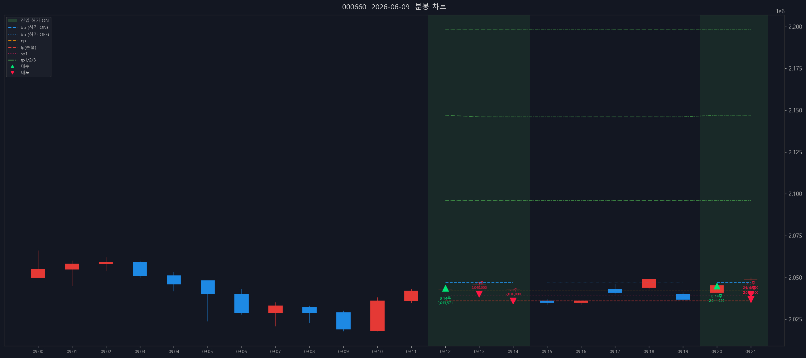

# SK하이닉스 (000660) — 2026-06-09

- 실현손익(당일 단순): +7,974,000원 (수수료 제외)

## 체결 타임라인

| 시각 | 구분 | 수량 | 체결가 | phase | 비고 |
|---:|---|---:|---:|---|---|
| 09:12:04 | 매수 | 14 | 2,043,571 | [매수 체결] |  |
| 09:13:36 | 매도 | 5 | 2,040,000 | partial | 부분청산 |
| 09:14:43 | 매도 | 1 | 2,036,000 | sell_order_partial | 분할체결 |
| 09:20:05 | 매수 | 14 | 2,044,929 | [매수 체결] |  |
| 09:21:43 | 매도 | 5 | 2,040,000 | partial | 부분청산 |
| 09:21:45 | 매도 | 1 | 2,037,000 | sell_order_partial | 분할체결 |
| 09:21:45 | 매도 | 3 | 2,037,000 | sell_order_partial | 분할체결 |
| 09:21:45 | 매도 | 17 | 2,037,000 | final | 전량청산 |

## 차트

---

_Generated by kiwoom-api-service journal export._