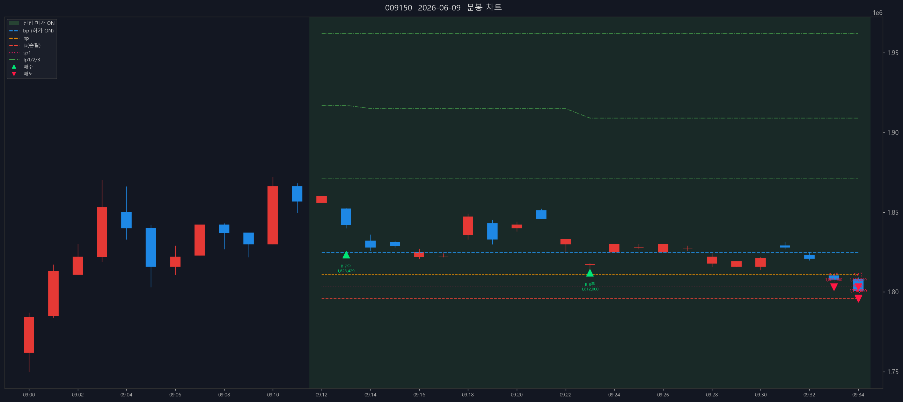

# 삼성전기 (009150) — 2026-06-09

- 실현손익(당일 단순): +33,873,997원 (수수료 제외)

## 체결 타임라인

| 시각 | 구분 | 수량 | 체결가 | phase | 비고 |
|---:|---|---:|---:|---|---|
| 09:13:40 | 매수 | 7 | 1,823,429 | [매수 체결] |  |
| 09:23:02 | 매수 | 8 | 1,812,000 | [2차 추매 체결] |  |
| 09:33:36 | 매도 | 4 | 1,803,000 | sell_order_partial | 분할체결 |
| 09:33:36 | 매도 | 6 | 1,803,000 | partial | 부분청산 |
| 09:34:29 | 매도 | 3 | 1,796,000 | sell_order_partial | 분할체결 |
| 09:34:29 | 매도 | 4 | 1,796,000 | sell_order_partial | 분할체결 |
| 09:34:29 | 매도 | 8 | 1,796,000 | sell_order_partial | 분할체결 |
| 09:34:29 | 매도 | 9 | 1,796,000 | final | 전량청산 |

## 차트

---

_Generated by kiwoom-api-service journal export._