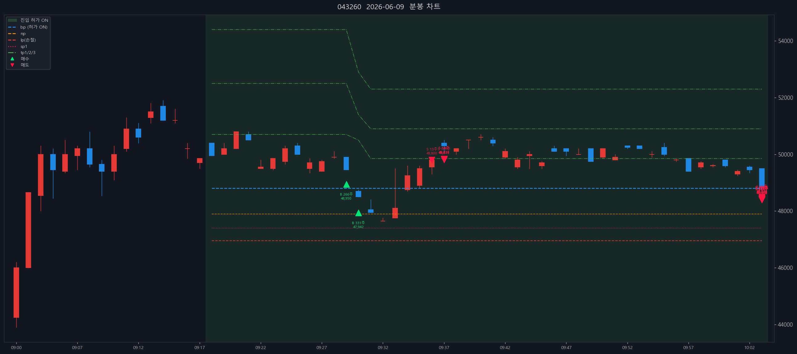

# 성호전자 (043260) — 2026-06-09

- 실현손익(FIFO): +436,246원 (매입단가 미확인 4291주 제외) (수수료·세금 제외)

## 체결 타임라인

| 시각 | 구분 | 수량 | 체결가 | phase | 비고 |
|---:|---|---:|---:|---|---|
| 09:29:35 | 매수 | 266 | 48,950 | [매수 체결] |  |
| 09:30:43 | 매수 | 331 | 47,942 | [2차 추매 체결] |  |
| 09:36:24 | 매도 | 13 | 49,800 | sell_order_partial | 분할체결 |
| 09:36:24 | 매도 | 54 | 49,838 | sell_order_partial | 분할체결 |
| 09:36:24 | 매도 | 55 | 49,837 | sell_order_partial | 분할체결 |
| 09:36:24 | 매도 | 179 | 49,811 | partial | 부분청산 |
| 10:03:49 | 매도 | 1 | 48,400 | sell_order_partial | 분할체결 |
| 10:03:49 | 매도 | 11 | 48,491 | sell_order_partial | 분할체결 |
| 10:03:49 | 매도 | 28 | 48,436 | sell_order_partial | 분할체결 |
| 10:03:49 | 매도 | 153 | 48,407 | sell_order_partial | 분할체결 |
| 10:03:49 | 매도 | 223 | 48,404 | sell_order_partial | 분할체결 |
| 10:03:49 | 매도 | 225 | 48,405 | sell_order_partial | 분할체결 |
| 10:03:50 | 매도 | 229 | 48,407 | sell_order_partial | 분할체결 |
| 10:03:50 | 매도 | 234 | 48,409 | sell_order_partial | 분할체결 |
| 10:03:50 | 매도 | 357 | 48,440 | sell_order_partial | 분할체결 |
| 10:03:50 | 매도 | 362 | 48,441 | sell_order_partial | 분할체결 |
| 10:03:50 | 매도 | 383 | 48,444 | sell_order_partial | 분할체결 |
| 10:03:50 | 매도 | 384 | 48,445 | sell_order_partial | 분할체결 |
| 10:03:50 | 매도 | 385 | 48,445 | sell_order_partial | 분할체결 |
| 10:03:50 | 매도 | 389 | 48,445 | sell_order_partial | 분할체결 |
| 10:03:50 | 매도 | 400 | 48,444 | sell_order_partial | 분할체결 |
| 10:03:50 | 매도 | 405 | 48,445 | sell_order_partial | 분할체결 |
| 10:03:50 | 매도 | 418 | 48,446 | final | 전량청산 |

## 차트

---

_Generated by kiwoom-api-service journal export._