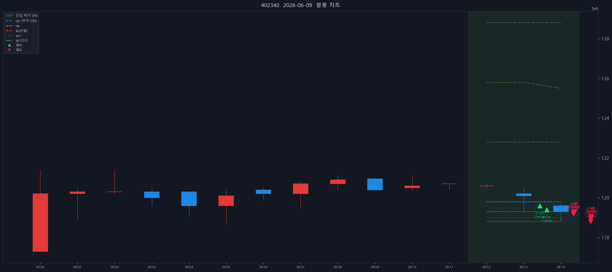

# SK스퀘어 (402340) — 2026-06-09

- 실현손익(FIFO): -55,665원 (매입단가 미확인 39주 제외) (수수료·세금 제외)

## 체결 타임라인

| 시각 | 구분 | 수량 | 체결가 | phase | 비고 |
|---:|---|---:|---:|---|---|
| 09:13:26 | 매수 | 10 | 1,196,000 | [매수 체결] |  |
| 09:13:37 | 매수 | 13 | 1,194,000 | [2차 추매 체결] |  |
| 09:14:20 | 매도 | 1 | 1,192,000 | sell_order_partial | 분할체결 |
| 09:14:21 | 매도 | 3 | 1,192,667 | sell_order_partial | 분할체결 |
| 09:14:21 | 매도 | 8 | 1,192,875 | sell_order_partial | 분할체결 |
| 09:14:22 | 매도 | 9 | 1,192,889 | partial | 부분청산 |
| 09:14:48 | 매도 | 1 | 1,188,000 | sell_order_partial | 분할체결 |
| 09:14:48 | 매도 | 3 | 1,189,333 | sell_order_partial | 분할체결 |
| 09:14:48 | 매도 | 11 | 1,190,545 | sell_order_partial | 분할체결 |
| 09:14:48 | 매도 | 12 | 1,190,500 | sell_order_partial | 분할체결 |
| 09:14:49 | 매도 | 14 | 1,190,429 | final | 전량청산 |

## 차트

---

_Generated by kiwoom-api-service journal export._