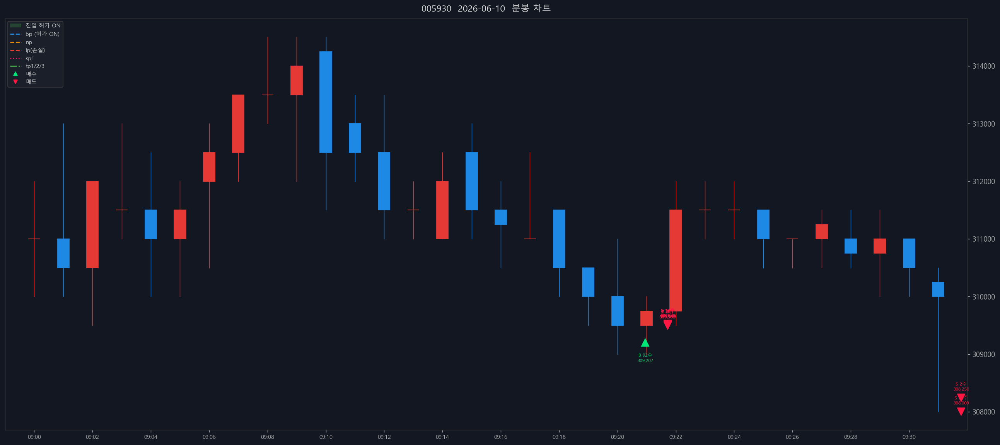
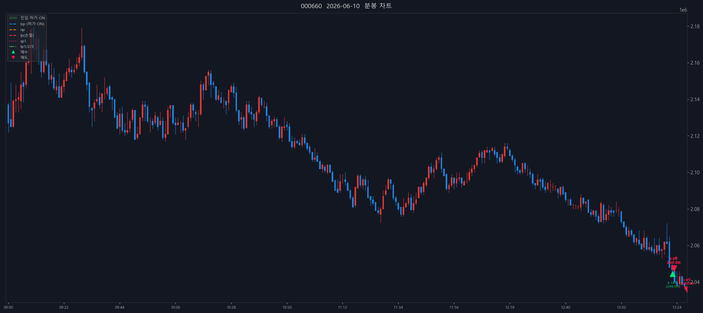

# 📒 매매일지 — 2026-06-10 (KR 종가 기준)

> 생성 시각: 2026-06-10 15:37:21 · 출처: kiwoom-api-service

---

## 0. 당일 총평

- 체결 종목: 3종 / 체결 33건 (매수 4 · 매도 29)
- 실현손익: +115,724,032원 (수수료 제외)
- 메모: (직접 작성 — 진입 근거, 실수, 개선점)

---

## 1. 성호전자 (043260)

### 1.1 체결 타임라인

| 시각 | 구분 | 수량 | 체결가 | phase | 비고 |
|---:|---|---:|---:|---|---|
| 09:18:08 | 매수 | 269 | 47,848 | [매수 체결] |  |
| 09:18:09 | 매수 | 329 | 47,900 | [2차 추매 체결] |  |
| 09:19:24 | 매도 | 34 | 47,450 | sell_order_partial | 분할체결 |
| 09:19:24 | 매도 | 36 | 47,450 | sell_order_partial | 분할체결 |
| 09:19:24 | 매도 | 105 | 47,450 | sell_order_partial | 분할체결 |
| 09:19:24 | 매도 | 239 | 47,478 | partial | 부분청산 |
| 09:28:22 | 매도 | 4 | 49,350 | sell_order_partial | 분할체결 |
| 09:28:22 | 매도 | 174 | 49,350 | sell_order_partial | 분할체결 |
| 09:28:22 | 매도 | 176 | 49,350 | sell_order_partial | 분할체결 |
| 09:28:22 | 매도 | 179 | 49,350 | partial | 부분청산 |
| 09:36:14 | 매도 | 1 | 47,875 | sell_order_partial | 분할체결 |
| 09:36:14 | 매도 | 6 | 47,875 | sell_order_partial | 분할체결 |
| 09:36:14 | 매도 | 86 | 47,852 | sell_order_partial | 분할체결 |
| 09:36:14 | 매도 | 96 | 47,854 | sell_order_partial | 분할체결 |
| 09:36:14 | 매도 | 180 | 47,852 | final | 전량청산 |

### 1.2 종목별 차트

## 2. 삼성전자 (005930)

### 2.1 체결 타임라인

| 시각 | 구분 | 수량 | 체결가 | phase | 비고 |
|---:|---|---:|---:|---|---|
| 09:20:57 | 매수 | 92 | 309,207 | [매수 체결] |  |
| 09:21:43 | 매도 | 1 | 309,500 | sell_order_partial | 분할체결 |
| 09:21:43 | 매도 | 17 | 309,500 | sell_order_partial | 분할체결 |
| 09:21:43 | 매도 | 18 | 309,528 | sell_order_partial | 분할체결 |
| 09:21:44 | 매도 | 19 | 309,526 | sell_order_partial | 분할체결 |
| 09:21:44 | 매도 | 36 | 309,514 | partial | 부분청산 |
| 09:32:47 | 매도 | 2 | 308,250 | sell_order_partial | 분할체결 |
| 09:32:47 | 매도 | 56 | 308,009 | final | 전량청산 |

### 2.2 종목별 차트

## 3. SK하이닉스 (000660)

### 3.1 체결 타임라인

| 시각 | 구분 | 수량 | 체결가 | phase | 비고 |
|---:|---|---:|---:|---|---|
| 13:22:14 | 매수 | 14 | 2,044,500 | [매수 체결] |  |
| 13:22:45 | 매도 | 2 | 2,047,500 | sell_order_partial | 분할체결 |
| 13:22:45 | 매도 | 3 | 2,047,333 | sell_order_partial | 분할체결 |
| 13:22:45 | 매도 | 4 | 2,047,500 | sell_order_partial | 분할체결 |
| 13:22:45 | 매도 | 5 | 2,047,600 | partial | 부분청산 |
| 13:27:56 | 매도 | 1 | 2,036,000 | sell_order_partial | 분할체결 |
| 13:27:56 | 매도 | 6 | 2,036,000 | sell_order_partial | 분할체결 |
| 13:27:56 | 매도 | 7 | 2,036,000 | sell_order_partial | 분할체결 |
| 13:27:56 | 매도 | 8 | 2,036,000 | sell_order_partial | 분할체결 |
| 13:27:56 | 매도 | 9 | 2,036,000 | final | 전량청산 |

### 3.2 종목별 차트

---

_Generated by kiwoom-api-service journal export._