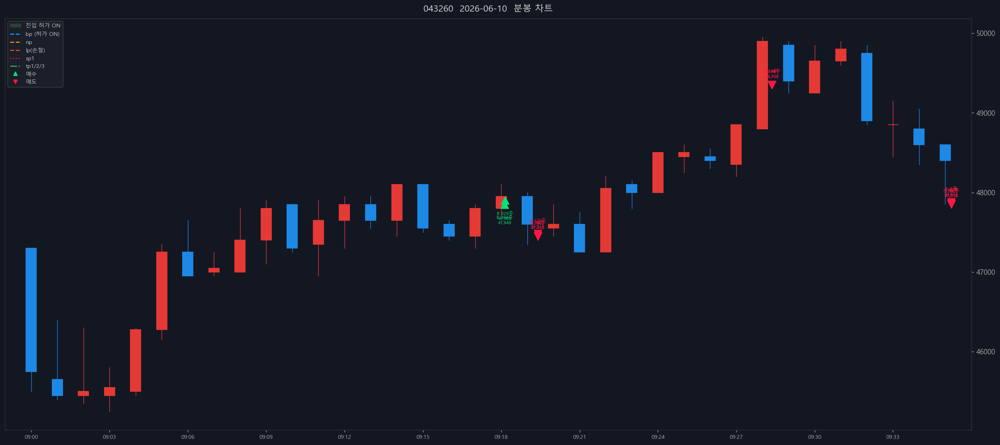

# 성호전자 (043260) — 2026-06-10

- 실현손익(당일 단순): +34,982,071원 (수수료 제외)

## 체결 타임라인

| 시각 | 구분 | 수량 | 체결가 | phase | 비고 |
|---:|---|---:|---:|---|---|
| 09:18:08 | 매수 | 269 | 47,848 | [매수 체결] |  |
| 09:18:09 | 매수 | 329 | 47,900 | [2차 추매 체결] |  |
| 09:19:24 | 매도 | 34 | 47,450 | sell_order_partial | 분할체결 |
| 09:19:24 | 매도 | 36 | 47,450 | sell_order_partial | 분할체결 |
| 09:19:24 | 매도 | 105 | 47,450 | sell_order_partial | 분할체결 |
| 09:19:24 | 매도 | 239 | 47,478 | partial | 부분청산 |
| 09:28:22 | 매도 | 4 | 49,350 | sell_order_partial | 분할체결 |
| 09:28:22 | 매도 | 174 | 49,350 | sell_order_partial | 분할체결 |
| 09:28:22 | 매도 | 176 | 49,350 | sell_order_partial | 분할체결 |
| 09:28:22 | 매도 | 179 | 49,350 | partial | 부분청산 |
| 09:36:14 | 매도 | 1 | 47,875 | sell_order_partial | 분할체결 |
| 09:36:14 | 매도 | 6 | 47,875 | sell_order_partial | 분할체결 |
| 09:36:14 | 매도 | 86 | 47,852 | sell_order_partial | 분할체결 |
| 09:36:14 | 매도 | 96 | 47,854 | sell_order_partial | 분할체결 |
| 09:36:14 | 매도 | 180 | 47,852 | final | 전량청산 |

## 차트

---

_Generated by kiwoom-api-service journal export._